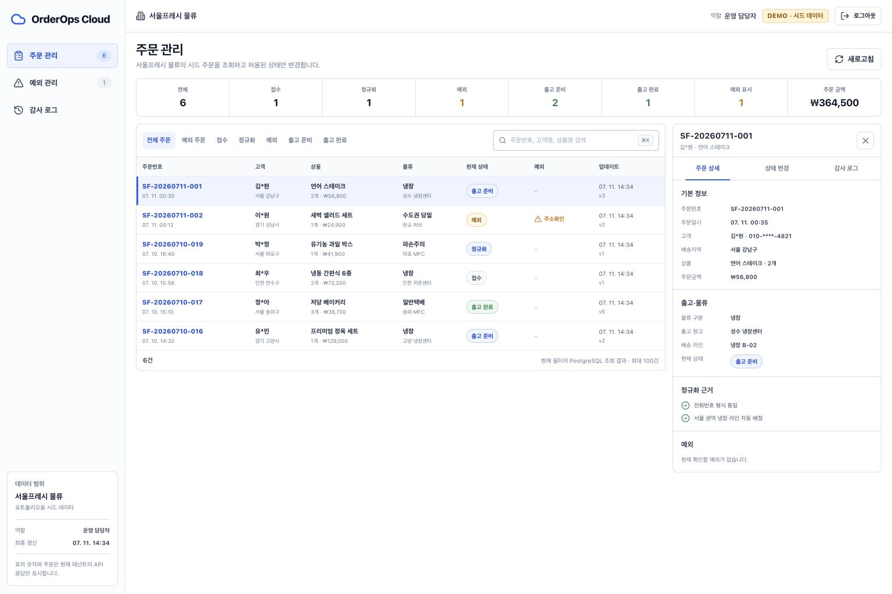
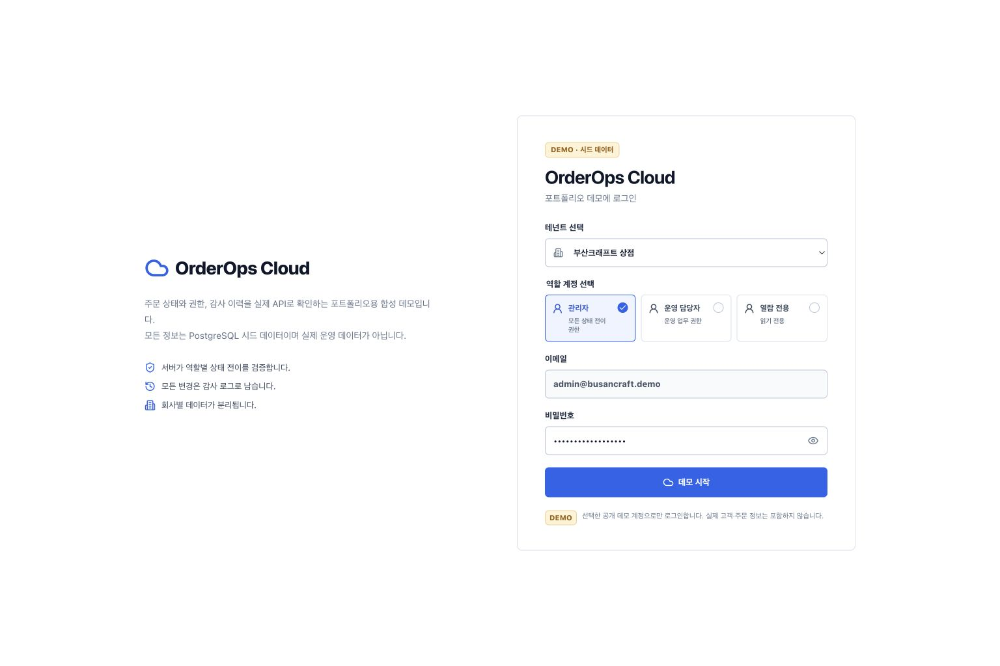
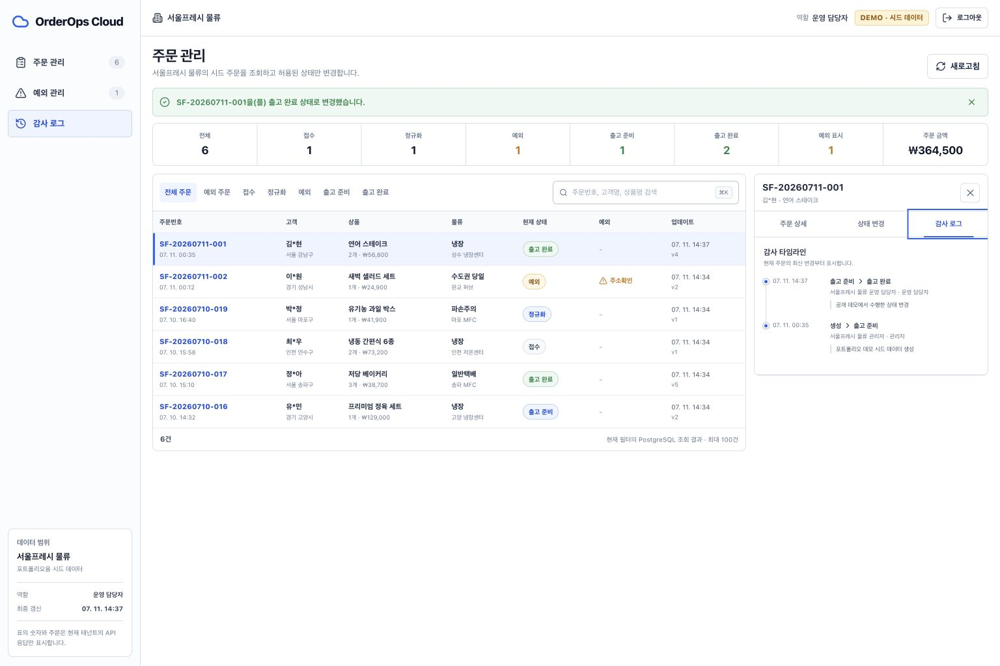
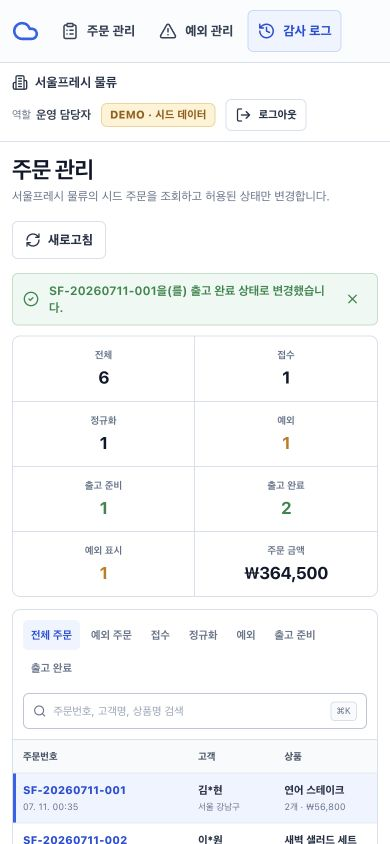
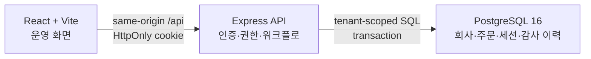

# OrderOps Cloud

한국형 주문 데이터를 정규화하고, 회사·역할별 권한 안에서 주문 상태를 변경하며, 모든 변경을 감사 이력으로 남기는 멀티테넌트 주문 운영 데모입니다.



> 개인 포트폴리오 프로젝트입니다. 화면의 회사, 사용자, 주문, 금액, 연락처, 감사 이력은 모두 합성한 시드 데이터입니다. 실제 고객 도입, 매출, 처리량, 비용 절감 또는 운영 성과를 주장하지 않습니다.

## 리뷰어가 확인할 수 있는 흐름

1. 두 가상 회사 중 하나와 `관리자`, `운영 담당자`, `열람 전용` 역할을 선택해 로그인합니다.
2. PostgreSQL에서 집계한 주문 지표와 회사별 주문만 조회합니다.
3. 검색, 상태, 예외 필터로 주문을 좁히고 우측 인스펙터에서 정규화 근거를 확인합니다.
4. 서버가 현재 역할과 상태에 허용한 다음 단계만 선택해 주문을 변경합니다.
5. 같은 트랜잭션에서 저장된 담당자, 이전·다음 상태, 변경 사유를 감사 로그에서 확인합니다.
6. 열람 전용 계정으로 다시 로그인해 화면과 API 양쪽에서 변경이 차단되는지 비교합니다.

## 실제 화면

| 데모 로그인 | 상태 변경 후 감사 이력 |
| --- | --- |
|  |  |

모바일 화면도 별도 UI를 흉내 내지 않고 같은 API와 권한 규칙을 사용합니다.



## 구현한 핵심

- React + TypeScript 기반 로그인, 주문 테이블, 필터, 상태 변경, 감사 타임라인
- Node.js 24 + Express 5 API와 PostgreSQL 16 영속화
- `tenant_id`를 모든 업무 쿼리에 적용한 회사별 데이터 격리
- `admin`, `operator`, `viewer` 역할과 서버 권한 검증
- `received → normalized → ready → shipped` 및 예외 처리 상태 전이
- 행 잠금과 `expectedVersion`을 함께 사용한 동시 수정 충돌 처리
- 주문 변경과 감사 이벤트를 한 PostgreSQL 트랜잭션으로 기록
- 일반 수정·삭제를 거부하는 감사 이벤트 DB 트리거
- `scrypt` 비밀번호 검증, 해시만 저장하는 불투명 세션, `HttpOnly` 쿠키
- 같은 출처 변경 표식, Fetch Metadata 확인, 보안 응답 헤더
- liveness/readiness 분리, 입력 검증, 안정적인 API 오류 코드
- 단위·PostgreSQL 통합·Playwright 사용자 흐름 테스트와 CI
- Docker Compose 로컬 실행, OpenAPI 명세, Vercel 배포 어댑터

## 구조



브라우저가 보내는 회사 ID나 역할은 신뢰하지 않습니다. 보호된 API는 세션에서 사용자와 회사를 복원하고, 서버가 상태 전이를 다시 검사합니다. 자세한 결정과 한계는 [아키텍처 문서](docs/architecture.md)에 정리했습니다.

## 빠른 실행

### Docker Compose

Docker Desktop 또는 Docker Engine과 Docker Compose v2가 있다면 다음 한 줄로 앱과 PostgreSQL을 함께 시작할 수 있습니다.

```bash
docker compose up --build
```

- 앱: `http://localhost:8787`
- liveness: `http://localhost:8787/api/health/live`
- PostgreSQL readiness: `http://localhost:8787/api/health/ready`

데이터까지 지우고 종료하려면 `docker compose down --volumes`를 사용합니다. 이 구성은 합성 데이터 로컬 데모 전용입니다.

### Node.js + 로컬 PostgreSQL

Node.js 24와 PostgreSQL 16이 필요합니다.

```bash
npm ci
cp .env.example .env
npm run db:setup
npm run dev
```

- React 개발 서버: `http://127.0.0.1:5182`
- Express API: `http://127.0.0.1:8787`

## 데모 계정

공통 로컬 데모 비밀번호는 `.env.example`의 `orderops-demo-2026`입니다. 실제 계정에 재사용하면 안 됩니다.

| 회사 | 관리자 | 운영 담당자 | 열람 전용 |
| --- | --- | --- | --- |
| 서울프레시 물류 | `admin@seoulfresh.demo` | `operator@seoulfresh.demo` | `viewer@seoulfresh.demo` |
| 부산크래프트 상점 | `admin@busancraft.demo` | `operator@busancraft.demo` | `viewer@busancraft.demo` |

로그인 화면에서 회사와 역할을 고르면 이메일과 비밀번호가 준비되므로 `데모 시작`을 누르면 됩니다.

## 검증

PostgreSQL이 준비된 합성 데이터 전용 환경에서 전체 검증을 실행합니다.

```bash
npm run verify
```

개별 검사는 다음과 같습니다.

```bash
npm test
npm run test:integration
npm run typecheck
npm run build
npm run test:e2e
npm audit --omit=dev
```

검증 범위에는 정상 상태 변경과 감사 기록, 열람 전용 거부, 다른 회사 주문 은닉, 오래된 버전 충돌, 감사 이벤트 수정·삭제 차단, 실제 브라우저의 로그인·변경·감사·모바일 흐름이 포함됩니다. 테스트 통과는 이 시나리오의 재현 결과이며 운영 환경의 성능, 가용성 또는 보안 인증을 의미하지 않습니다.

## 공개 데모 안전 모드

`PUBLIC_DEMO_MODE=true`는 알려진 데모 계정으로 공유 DB를 공개할 때만 사용합니다.

- 로그인 성공 시 해당 가상 회사의 주문과 감사 이력만 시드 상태로 초기화합니다.
- 사용자와 다른 방문자의 세션은 삭제하지 않습니다.
- 자유 입력 변경 사유 대신 안전한 고정 문구를 저장합니다.
- 상태 변경 요청에 간단한 세션·IP 제한을 적용합니다.

이는 포트폴리오 데모의 오염을 줄이는 최소 장치이며 방문자별 완전 격리는 아닙니다. 동시에 접속한 두 사용자는 같은 합성 회사 상태를 공유해 충돌할 수 있습니다. 로컬 기본 모드에서는 초기화와 메모 제한 없이 전체 변경 흐름을 확인할 수 있습니다.

## 문서

- [아키텍처와 신뢰 경계](docs/architecture.md)
- [한국어 사례 연구](docs/case-study-ko.md)
- [실행·장애 대응 런북](docs/runbook.md)
- [OpenAPI 3.1 명세](docs/openapi.yaml)
- [포트폴리오 등록용 문구](docs/portfolio-copy-ko.md)
- [UI 디자인 계약과 토큰](docs/design-system.md)
- [Lazyweb UI 개선 보고서](https://www.lazyweb.com/report/lazyweb/74149dcb-d459-4ba6-ab28-2e9004b248a1/?source=create)

## 현재 한계

비밀번호 재설정, MFA, 분산 로그인 제한, PostgreSQL RLS, 버전형 마이그레이션, 실제 택배사·웹훅 연동, 구조화 로그·APM, 백업 복구 훈련, 부하 테스트는 포함하지 않았습니다. 포함된 Docker와 Vercel 파일은 이 포트폴리오 데모를 재현하기 위한 구성이며, 그대로 일반 고객 데이터를 처리하는 운영 구성으로 간주하지 않습니다.
