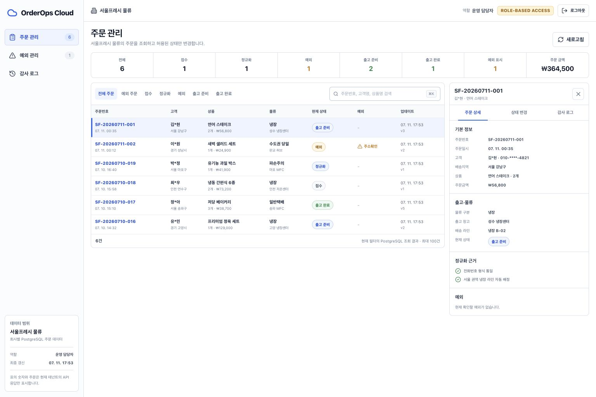
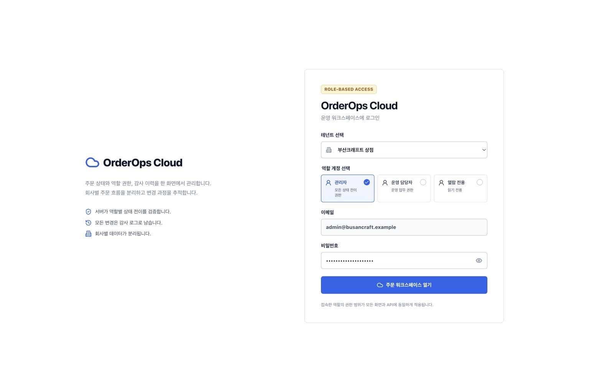
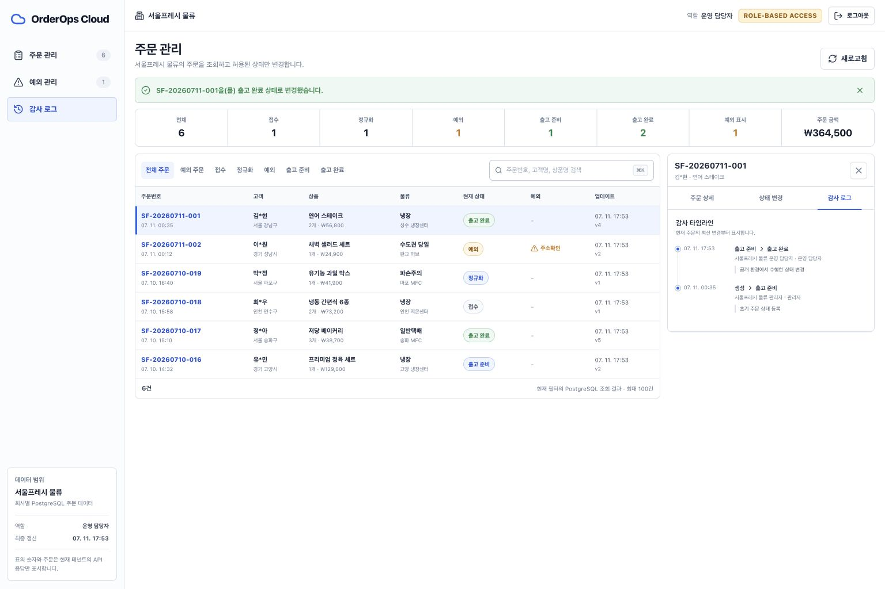
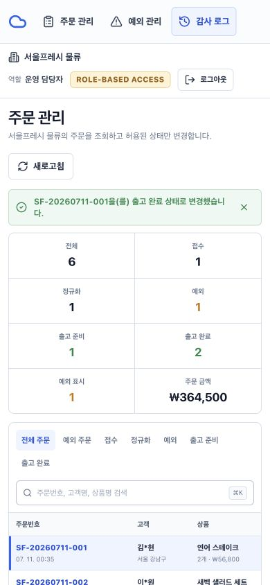

# OrderOps Cloud

[](https://github.com/Egoistian/orderops-cloud/actions/workflows/ci.yml)

회사별 주문을 한곳에서 조회하고, 역할 권한에 따라 상태를 변경하며, 모든 변경 과정을 감사 이력으로 남기는 멀티테넌트 주문 운영 시스템입니다.



## 핵심 업무 흐름

1. 서울프레시 물류 또는 부산크래프트 상점의 역할별 계정으로 로그인합니다.
2. PostgreSQL에서 집계한 주문 지표와 현재 회사의 주문만 조회합니다.
3. 검색, 상태, 예외 필터로 주문을 좁히고 우측 인스펙터에서 정규화 근거를 확인합니다.
4. 서버가 현재 역할과 상태에 허용한 다음 단계만 선택해 주문을 변경합니다.
5. 같은 트랜잭션에서 저장된 담당자, 이전·다음 상태, 변경 사유를 감사 로그에서 확인합니다.
6. 열람 전용 계정으로 로그인하면 화면과 API 양쪽에서 변경이 차단됩니다.

## 제품 화면

| 역할별 로그인 | 상태 변경 후 감사 이력 |
| --- | --- |
|  |  |

모바일 화면도 같은 API와 권한 규칙을 사용합니다.



## 구현 범위

- React + TypeScript 기반 로그인, 주문 테이블, 필터, 상태 변경, 감사 타임라인
- Node.js 24 + Express 5 API와 PostgreSQL 16 영속화
- `tenant_id`를 모든 업무 쿼리에 적용한 회사별 데이터 격리
- `admin`, `operator`, `viewer` 역할과 서버 권한 검증
- `received → normalized → ready → shipped` 및 예외 처리 상태 전이
- 행 잠금과 `expectedVersion`을 함께 사용한 동시 수정 충돌 처리
- 주문 변경과 감사 이벤트를 한 PostgreSQL 트랜잭션으로 기록
- 일반 수정·삭제를 거부하는 감사 이벤트 DB 트리거
- `scrypt` 비밀번호 검증, 해시만 저장하는 불투명 세션, `HttpOnly` 쿠키
- 같은 출처 변경 표식, Fetch Metadata 확인, 보안 응답 헤더
- liveness/readiness 분리, 입력 검증, 안정적인 API 오류 코드
- 단위·PostgreSQL 통합·Playwright 사용자 흐름 테스트와 CI
- Docker Compose 로컬 실행, OpenAPI 명세, Vercel 배포 어댑터

## 구조


브라우저가 보내는 회사 ID나 역할은 신뢰하지 않습니다. 보호된 API는 세션에서 사용자와 회사를 복원하고, 서버가 상태 전이를 다시 검사합니다. 자세한 결정과 신뢰 경계는 [아키텍처 문서](docs/architecture.md)에 정리했습니다.

## 빠른 실행

### Docker Compose

Docker Desktop 또는 Docker Engine과 Docker Compose v2가 있다면 다음 한 줄로 앱과 PostgreSQL을 함께 시작할 수 있습니다.

```bash
docker compose up --build
```

- 앱: `http://localhost:8787`
- liveness: `http://localhost:8787/api/health/live`
- PostgreSQL readiness: `http://localhost:8787/api/health/ready`

[주문 워크스페이스 열기](http://localhost:8787)

데이터 볼륨까지 삭제하고 종료하려면 `docker compose down --volumes`를 사용합니다.

### Node.js + 로컬 PostgreSQL

Node.js 24와 PostgreSQL 16이 필요합니다.

```bash
npm ci
cp .env.example .env
npm run db:setup
npm run dev
```

- React 개발 서버: `http://127.0.0.1:5182`
- Express API: `http://127.0.0.1:8787`

## 역할별 계정

공통 접근 비밀번호는 `.env.example`의 `ACCESS_ACCOUNT_PASSWORD=orderops-access-2026`입니다.

| 회사 | 관리자 | 운영 담당자 | 열람 전용 |
| --- | --- | --- | --- |
| 서울프레시 물류 | `admin@seoulfresh.example` | `operator@seoulfresh.example` | `viewer@seoulfresh.example` |
| 부산크래프트 상점 | `admin@busancraft.example` | `operator@busancraft.example` | `viewer@busancraft.example` |

로그인 화면에서 회사와 역할을 고르면 계정 정보가 준비됩니다. `주문 워크스페이스 열기`를 눌러 시작합니다.

## 검증

PostgreSQL이 준비된 환경에서 전체 검증을 실행합니다.

```bash
npm run verify
```

개별 검사는 다음과 같습니다.

```bash
npm test
npm run test:integration
npm run typecheck
npm run build
npm run test:e2e
npm audit --omit=dev
```

검증 범위에는 정상 상태 변경과 감사 기록, 열람 전용 거부, 다른 회사 주문 은닉, 오래된 버전 충돌, 감사 이벤트 수정·삭제 차단, 브라우저 로그인·변경·감사·모바일 흐름이 포함됩니다.

## 공유 환경 보호 모드

`SHARED_ACCESS_MODE=true`는 여러 사용자가 하나의 공개 DB에 접근할 때 서버 측 보호 기능을 활성화합니다.

- 로그인 성공 시 해당 회사의 주문과 감사 이력을 기준 상태로 초기화합니다.
- 사용자와 기존 세션은 유지합니다.
- 자유 입력 변경 사유 대신 `공개 환경에서 수행한 상태 변경`을 저장합니다.
- 로그인과 상태 변경 요청에 인스턴스 단위 제한을 적용합니다.
- 로그인·세션 응답의 `user.sharedAccessMode`로 화면의 입력 방식을 조정합니다.

공유 상태는 회사 단위이므로 동시에 같은 회사에 접근하면 초기화 또는 `409 VERSION_CONFLICT`가 발생할 수 있습니다. 로컬 기본 모드에서는 자동 초기화와 공유 환경용 변경 제한 없이 전체 변경 흐름을 확인할 수 있습니다.

## 문서

- [아키텍처와 신뢰 경계](docs/architecture.md)
- [한국어 사례 연구](docs/case-study-ko.md)
- [실행·장애 대응 런북](docs/runbook.md)
- [OpenAPI 3.1 명세](docs/openapi.yaml)
- [프로젝트 소개](docs/project-overview-ko.md)
- [UI 디자인 계약과 토큰](docs/design-system.md)

## 현재 범위

비밀번호 재설정, MFA, 분산 요청 제한, PostgreSQL RLS, 버전형 마이그레이션, 택배사·웹훅 연동, 구조화 로그·APM, 백업 복구 훈련, 부하 테스트는 아직 포함하지 않았습니다. Docker Compose는 로컬 실행을, Vercel 어댑터는 서버리스 배포 경로를 담당합니다.
