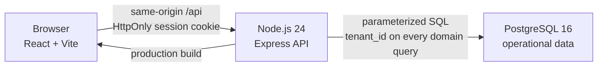
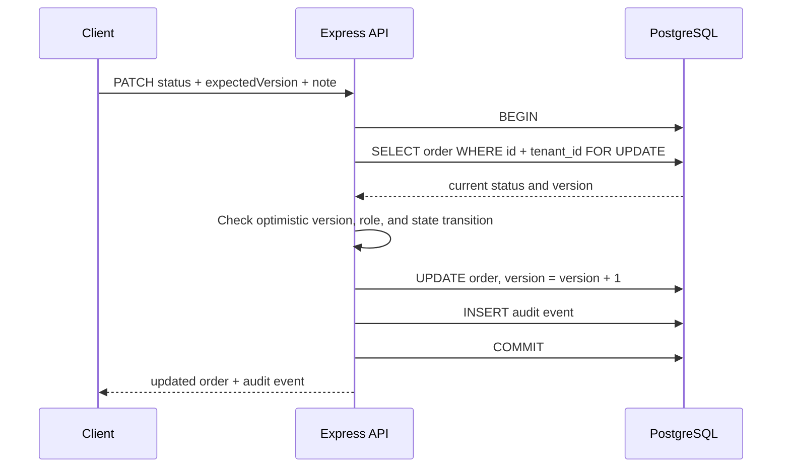
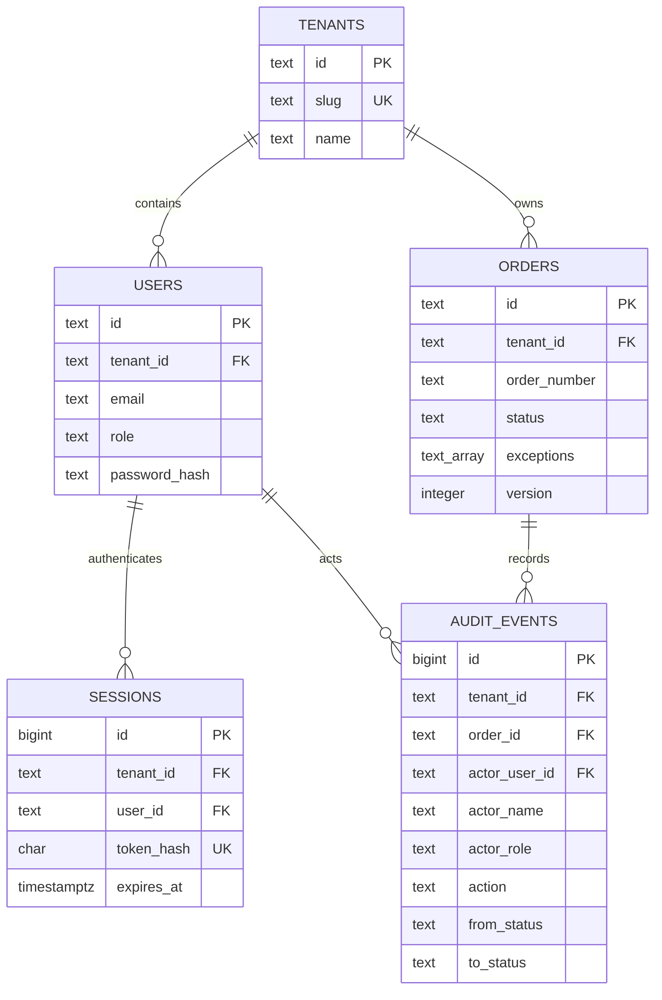

# OrderOps Cloud architecture

## Scope and evidence boundary

OrderOps Cloud is a personal portfolio project that models a small multi-tenant order-operations service. All companies, users, orders, amounts, and audit events in the seed are synthetic. The repository demonstrates an implementation and its automated checks; it does not claim a production deployment, real customers, revenue, throughput, uptime, or a measured performance improvement.

## System view

In development, Vite serves the React app and proxies `/api` to the Express process. In the production build, the Express process serves both `dist/` and the API so the browser can use a same-origin cookie without a separate CORS policy.

The PostgreSQL pool uses a five-second connection timeout and a 30-second idle timeout. A normal long-running server defaults to 10 connections. A Vercel runtime defaults to 2 and allows the pool to exit when idle; `DATABASE_POOL_MAX` can explicitly set 1–50 connections. These are safe defaults, not measured capacity recommendations.

## Components

| Component | Responsibility | Important boundary |
| --- | --- | --- |
| React client | Login, order filtering, status actions, and audit presentation | Treats server-provided roles and transitions as display hints; the server remains authoritative |
| Express API | Validates inputs, authenticates sessions, applies role/workflow rules, and shapes responses | Does not trust tenant IDs, roles, or allowed transitions from the browser |
| PostgreSQL store | Persists tenants, users, hashed sessions, orders, and append-only audit events | Tenant-scoped queries and composite foreign keys prevent cross-tenant relationships |
| Database scripts | Create the database, apply the current schema, and seed deterministic demo data | `db:setup` and `db:reset` are demo operations, not a production migration strategy |

## Request and trust flow

### Login and session lookup

1. The client sends a tenant slug, email, and password to `POST /api/auth/login` with JSON content type and the same-origin request marker `X-OrderOps-Request: 1`.
2. The API looks up the active user inside that tenant.
3. Password verification derives a key with Node's `scrypt` and compares it with `timingSafeEqual`. An unknown account still runs a dummy `scrypt` verification so the obvious missing-user path does not return early.
4. A cryptographically random 32-byte token is returned only as an `HttpOnly`, `SameSite=Strict` cookie. `Secure` is also set in production unless the local-demo override explicitly disables it.
5. PostgreSQL stores only the SHA-256 hash of that token, its user/tenant pair, and its expiry time.
6. Every protected API request resolves the cookie hash back to an active user and tenant. Sessions expire after eight hours.

The public demo-account endpoint intentionally exposes synthetic demo names, roles, emails, and tenant slugs so a reviewer can enter the sample application. It must not be reused for real accounts.

Login, logout, and status changes require the custom request marker. When the browser supplies Fetch Metadata, the API also rejects a `Sec-Fetch-Site` value other than `same-origin` or `none`. This works with the same-origin deployment and `SameSite=Strict` cookie as a layered CSRF mitigation; the marker is not a secret or a replacement for a complete origin-specific threat assessment.

### Tenant isolation

Tenant membership comes from the authenticated session, never from a request body or query parameter.

- Order list, metrics, audit, and mutation queries include the authenticated `tenant_id`.
- `users`, `orders`, sessions, and audit events use tenant-aware unique constraints or composite foreign keys.
- A status mutation or audit read for an order in another tenant returns `404`, hiding whether that identifier exists elsewhere.

This is application-enforced isolation. PostgreSQL row-level security is not enabled in the current portfolio version.

### Status transition transaction

The row lock serializes concurrent mutations. `expectedVersion` provides an explicit optimistic-concurrency contract: a stale client receives `409 VERSION_CONFLICT` and must reload instead of silently overwriting newer work. The order update and its audit record commit together; either both persist or both roll back. Each audit row snapshots the actor name and role used at the time of the change.

PostgreSQL also installs a trigger that rejects ordinary `UPDATE` and `DELETE` operations on audit events. The deterministic seed uses an explicit transaction-local maintenance flag to reset synthetic data. A database owner can still alter or bypass this trigger, so “append-only” describes the normal application path rather than tamper-proof external storage.

## Data model

## Authorization and workflow rules

- `admin`: may use every transition defined for the current state.
- `operator`: may normalize, resolve exceptions, mark ready, and mark shipped; cannot move a ready order back to exception.
- `viewer`: read-only.
- `shipped`: terminal in the current model.

The API calculates `allowedTransitions` for each returned order for client convenience, then checks the same rules again during mutation.

## Shared public-demo mode

`PUBLIC_DEMO_MODE=true` is an explicit server-side mode for a shared deployment that contains only the synthetic seed. It is disabled by default, so the normal local application keeps user-entered audit notes and does not reset data on login.

After a valid synthetic demo login in public mode, the API resets only that user's tenant orders and audit events in one transaction. Users and existing sessions are preserved. The reset and status transitions take the same tenant-scoped PostgreSQL advisory lock so those writes cannot run through each other. Login and session responses expose `user.publicDemoMode`, allowing the client to remove the free-text note field.

Public mode also replaces every submitted note with the fixed text `공개 데모에서 수행한 상태 변경`. A single Node.js instance allows at most 10 successful login/resets per IP-and-account key and 30 status-change attempts per session in 10 minutes; it also caps status-change attempts at 120 per socket address in that window. Rejected requests return `429` and `Retry-After`.

These controls are intentionally small portfolio safeguards, not distributed abuse prevention. They use in-memory counters, so Vercel instances do not share them and a restart clears them. The address key uses the direct socket address rather than trusting a caller-supplied forwarding header; behind Vercel or another proxy, multiple visitors may therefore share one address bucket. A production system would use a trusted edge identity plus a shared limiter.

The public database is still shared at tenant level, not cloned per session. A later successful login can reset the tenant while another reviewer is using it, so that reviewer may see fresh seed data or a `409` version conflict. This tradeoff is acceptable only for a low-traffic synthetic portfolio demo and is stated in the UI/runbook; it is not session isolation.

## Failure behavior

- Missing or expired session: `401` with a stable error code.
- Invalid filters, order IDs, JSON syntax, or workflow inputs: `400` with a specific error code.
- Oversized JSON body: `413 PAYLOAD_TOO_LARGE`.
- Login or status body without JSON content type: `415 JSON_REQUIRED`.
- Missing same-origin marker or rejected Fetch Metadata: `403 CSRF_REJECTED`.
- Role or state disallows a transition: `403 TRANSITION_FORBIDDEN`.
- Order is outside the session tenant or absent: `404 ORDER_NOT_FOUND` for mutation and audit read.
- Stale version: `409 VERSION_CONFLICT`.
- Public-demo login/reset or mutation budget exhausted: `429 DEMO_LOGIN_RATE_LIMITED` or `429 DEMO_MUTATION_RATE_LIMITED` with `Retry-After`.
- Unexpected store/server error: generic `500 INTERNAL_ERROR`; the underlying error is logged server-side.

## Current limitations

This implementation deliberately stops at a portfolio-sized vertical slice.

- No password reset, MFA, centralized session revocation UI, or distributed limiter. Failed-login and public-demo limits are per Node.js instance.
- CSRF mitigation uses `SameSite=Strict`, a required custom header, and Fetch Metadata rather than a separate synchronizer-token scheme.
- Expired sessions are cleared during session creation, at server startup, and every 15 minutes, but there is no user-facing session inventory or remote revocation control.
- List results are capped at 100 and do not expose cursor pagination.
- Tenant isolation is enforced in application SQL, not PostgreSQL row-level security.
- Schema changes use one idempotent SQL file; there is no versioned migration ledger or rollback tooling.
- No queue, webhook delivery, object storage, carrier integration, monitoring backend, or load test.
- The included Compose configuration is for local demonstration. TLS, secret management, managed backups, and a production deployment are not configured.
- Public-demo reset state is shared by tenant rather than isolated per reviewer session.

These are explicit next-step areas, not capabilities implied by the current repository.
