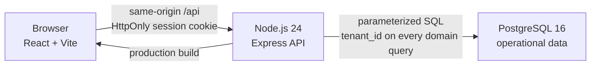
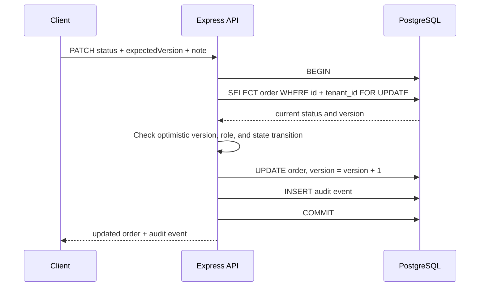
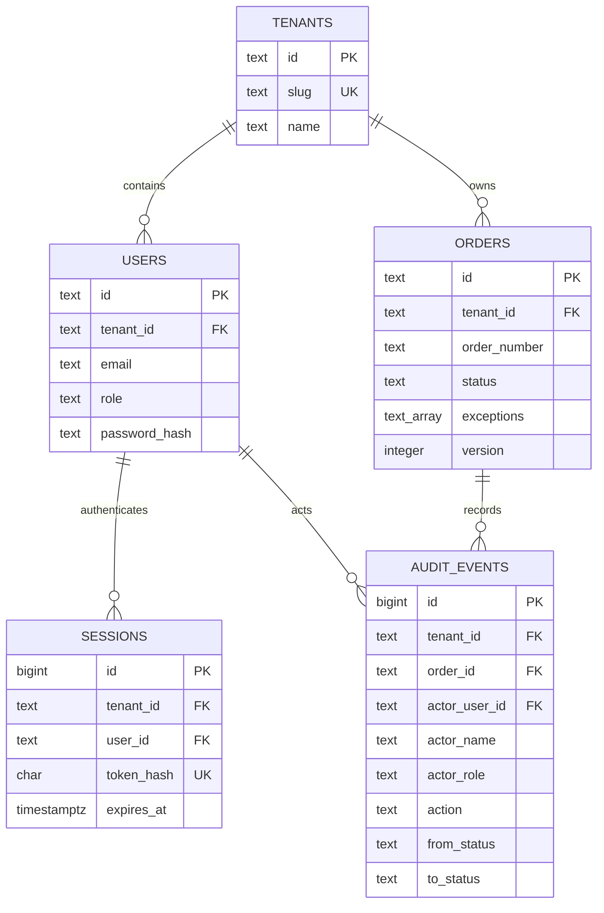

# OrderOps Cloud architecture

## System view

In development, Vite serves the React app and proxies `/api` to Express. In the production build, Express serves both `dist/` and the API so the browser can use a same-origin cookie without a separate CORS policy.

The PostgreSQL pool uses a five-second connection timeout and a 30-second idle timeout. A long-running server defaults to 10 connections. A Vercel runtime defaults to 2 and allows the pool to exit when idle; `DATABASE_POOL_MAX` can set 1–50 connections.

## Components

| Component | Responsibility | Important boundary |
| --- | --- | --- |
| React client | Login, order filtering, status actions, and audit presentation | Treats server-provided roles and transitions as display hints; the server remains authoritative |
| Express API | Validates inputs, authenticates sessions, applies role and workflow rules, and shapes responses | Does not trust tenant IDs, roles, or allowed transitions from the browser |
| PostgreSQL store | Persists tenants, users, hashed sessions, orders, and append-only audit events | Tenant-scoped queries and composite foreign keys prevent cross-tenant relationships |
| Database scripts | Create the database, apply the schema, and load deterministic baseline records | `db:setup` and `db:reset` replace known workspace records and are not a versioned migration strategy |

## Request and trust flow

### Login and session lookup

1. The client loads account metadata from `GET /api/auth/access-accounts`.
2. It sends a tenant slug, email, and password to `POST /api/auth/login` with JSON content type and `X-OrderOps-Request: 1`.
3. The API looks up an active user inside that tenant.
4. Password verification derives a key with Node's `scrypt` and compares it with `timingSafeEqual`. An unknown account still runs a dummy verification so the missing-user path does not return early.
5. A cryptographically random 32-byte token is returned only as an `HttpOnly`, `SameSite=Strict` cookie. `Secure` is also set in production unless the local HTTP override disables it.
6. PostgreSQL stores only the SHA-256 hash of that token, its user/tenant pair, and its expiry time.
7. Every protected API request resolves the cookie hash back to an active user and tenant. Sessions expire after eight hours.

The access-account endpoint returns role, tenant, name, and email metadata without returning a password or password hash. Login, logout, and status changes require the custom request marker. When the browser supplies Fetch Metadata, the API rejects a `Sec-Fetch-Site` value other than `same-origin` or `none`. This works with the same-origin deployment and `SameSite=Strict` cookie as layered CSRF mitigation.

### Tenant isolation

Tenant membership comes from the authenticated session, never from a request body or query parameter.

- Order list, metrics, audit, and mutation queries include the authenticated `tenant_id`.
- `users`, `orders`, sessions, and audit events use tenant-aware unique constraints or composite foreign keys.
- A status mutation or audit read for an order in another tenant returns `404`, hiding whether that identifier exists elsewhere.

Tenant isolation is enforced in application SQL. PostgreSQL row-level security is outside the current scope.

### Status transition transaction

The row lock serializes concurrent mutations. `expectedVersion` provides an explicit optimistic-concurrency contract: a stale client receives `409 VERSION_CONFLICT` and reloads before attempting another change. The order update and its audit record commit together; either both persist or both roll back. Each audit row snapshots the actor name and role used at the time of the change.

PostgreSQL installs a trigger that rejects ordinary `UPDATE` and `DELETE` operations on audit events. Baseline data loading uses an explicit transaction-local maintenance flag to replace records. A database owner can alter or bypass the trigger, so append-only describes the normal application path.

## Data model

## Authorization and workflow rules

- `admin`: may use every transition defined for the current state.
- `operator`: may normalize, resolve exceptions, mark ready, and mark shipped; cannot move a ready order back to exception.
- `viewer`: read-only.
- `shipped`: terminal in the current workflow.

The API calculates `allowedTransitions` for each returned order for client convenience, then checks the same rules again during mutation.

## Shared access mode

`SHARED_ACCESS_MODE=true` activates controls for a deployment where multiple visitors use the same workspace records. It is disabled by default.

After a valid access-account login, the API resets that user's tenant orders and audit events in one transaction. Users and existing sessions remain. The reset and status transitions take the same tenant-scoped PostgreSQL advisory lock so those writes cannot overlap. Login and session responses expose `user.sharedAccessMode`, allowing the client to remove the free-text note field.

Shared access mode replaces every submitted note with `공개 환경에서 수행한 상태 변경`. A single Node.js instance allows at most 10 successful login/resets per IP-and-account key and 30 status-change attempts per session in 10 minutes; it also caps status-change attempts at 120 per socket address in that window. Rejected requests return `429`, `Retry-After`, and either `SHARED_ACCESS_LOGIN_RATE_LIMITED` or `SHARED_ACCESS_MUTATION_RATE_LIMITED`.

The counters live in process memory, so separate server instances do not share them and a restart clears them. The address key uses the direct socket address rather than a caller-supplied forwarding header. Behind a proxy, multiple visitors may share one address bucket. Distributed limiting can be added through a shared store or trusted edge identity.

Workspace state is shared at tenant level, not cloned per session. A later successful login can reset the tenant while another user is active, so that user may see baseline records or a `409 VERSION_CONFLICT`.

## Failure behavior

- Missing or expired session: `401` with a stable error code.
- Invalid filters, order IDs, JSON syntax, or workflow inputs: `400` with a specific error code.
- Oversized JSON body: `413 PAYLOAD_TOO_LARGE`.
- Login or status body without JSON content type: `415 JSON_REQUIRED`.
- Missing same-origin marker or rejected Fetch Metadata: `403 CSRF_REJECTED`.
- Role or state disallows a transition: `403 TRANSITION_FORBIDDEN`.
- Order is outside the session tenant or absent: `404 ORDER_NOT_FOUND` for mutation and audit read.
- Stale version: `409 VERSION_CONFLICT`.
- Shared login/reset or mutation budget exhausted: `429 SHARED_ACCESS_LOGIN_RATE_LIMITED` or `429 SHARED_ACCESS_MUTATION_RATE_LIMITED` with `Retry-After`.
- Unexpected store/server error: generic `500 INTERNAL_ERROR`; the underlying error is logged server-side.

## Current scope

- No password reset, MFA, centralized session revocation UI, or distributed limiter. Failed-login and shared-access limits are per Node.js instance.
- CSRF mitigation uses `SameSite=Strict`, a required custom header, and Fetch Metadata rather than a separate synchronizer-token scheme.
- Expired sessions are cleared during session creation, at server startup, and every 15 minutes; there is no user-facing session inventory or remote revocation control.
- List results are capped at 100 and do not expose cursor pagination.
- Tenant isolation is enforced in application SQL, not PostgreSQL row-level security.
- Schema changes use one idempotent SQL file; there is no versioned migration ledger or rollback tooling.
- Queue processing, webhook delivery, object storage, carrier integration, monitoring backend, and load testing are not included.
- The Compose configuration targets local execution; TLS, secret management, managed backups, and production observability are deployment responsibilities.
- Shared access reset state is tenant-wide rather than isolated per user session.
